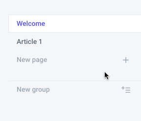
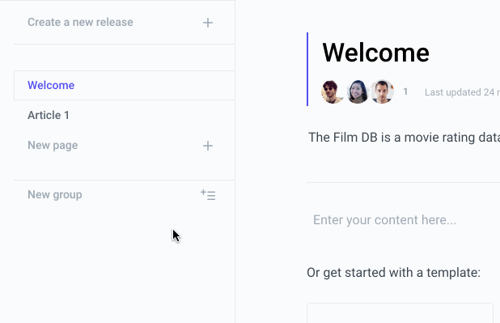
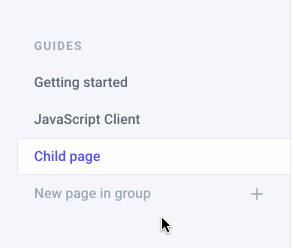
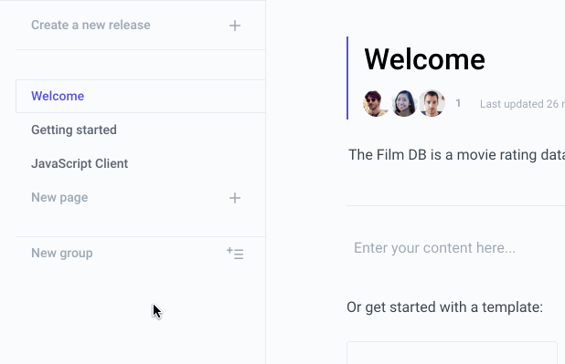

# Introduction

In the OzHarvest Knowledge Base, a space is the documentation site for one of your project. Each space then contains as many articles as you want \(**pages**\). They will all appear in the **Table of Contents \(ToC\)** on the left.

## Types of Entries

Pages can be nested and grouped. But before that you should know about the three different types of entry that you can put in the Table of Contents:

* **Pages**: This is a basic article. It has a title and an optional description, and you can then put any content inside it.
* **External links**: These entries are just links. You can use them to link to external websites.
* **Groups**: These do not have content, but they serve to group pages together under a title. They don't have content themselves.

## Structuring

### Adding pages

### Adding links

### Nesting pages

You can nest pages under each others by drag and dropping a page under another. The children of a page will be hidden and collapsed by default. There is no theoretical limit to page nesting. But we advise to avoid going deeper than 3 levels of nesting. Note that the homepage of our documentation \(the first page\) cannot have children.

### Using Groups

Groups can only live at the top level of the Table of Contents. You cannot nest groups inside groups. Note that you cannot put your documentation homepage under a group.

