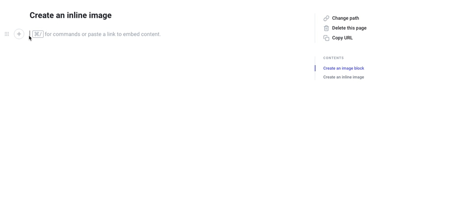

# User Guide

## Content Types

### Headings

Headings are what structures your documents. Heading levels 1 and 2 will appear in the document's navigation on the right. 

All headings have a link near them which is a link that your readers can use to point to a particular section of your documentation.

OzHarvest Knowledge Base offers 3 levels of headings,which is the best way to [structure our documentation.](https://practicaltypography.com/headings.html)

### Hints & Callouts

A great way to bring the reader's attention to specific elements is to use hints

### Tabs

You can structure your content in tabs. Here is an example that list instructions relevant to specific phone types



Here are the instructions concerning Android



Here are the instructions concerning iOS



### Other Content Types

There are many other content types available such as files, images, quotes, tables & more. For additional help around these content types. please contact your wiki administrator

## Embeds

Embed rich content from the Web, such as YouTube videos, GitHub Gists, Medium article, etc.

### How to embed content

To add a rich embed, simply paste the link of the content you want to embed, then press `ENTER` and voilà ✨.

### Examples

#### Videos



### Medium Articles



## Images

### Image block

The most common type of images are "image block". They're full width images with a caption. You can decide to align them to the left, center. You can insert an image block from the command palette:

### Inline image

By default, inline images are sized proportionally to the font size. It's especially great for inline badges and icons, among other things. When inserting an inline image, you can also set it to its "original size". By doing so, the image will remain inline but with its original size until a maximum width. To create an inline image from the "plus" menu appearing when hovering your caret:

You can change the inline image's size by selecting it, a menu will appear above it. Note that you can also turn an inline image into a block image.

## Saving Your Work

To save your changes, just click the green tick on the bottom right, this will save your changes to the Wiki. This does not publish your changes though

##  Publishing Your Work

To publish your work. After you click save. Scroll over to the Merge button on the right hand menu and this publish your content to the entire organisation

## Leaving Comments

To leave a comment, just click the leave a comment bubble placed to the right of the section you wish to comment. These comments are only visible to writers & editors.

